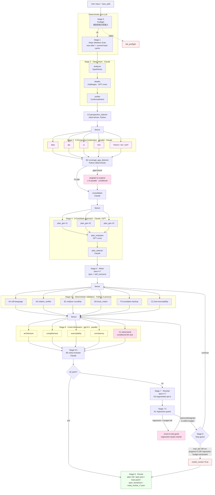
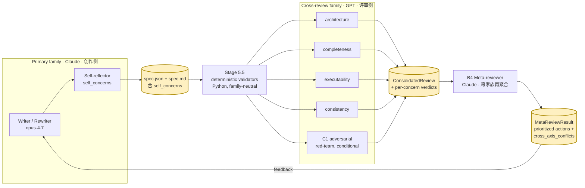
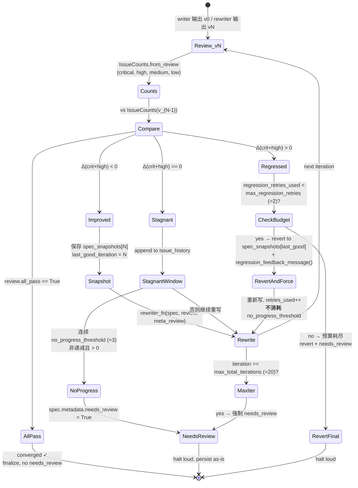
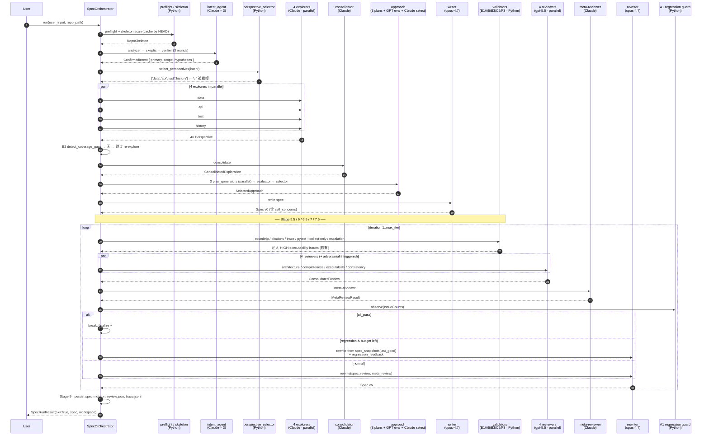

# DevLoop Spec Phase — Architecture

> 配套文档：`SHOWCASE_README.md`（产品视角、效果数字）、`docs/architecture.md`（早期速写）。
> 本文档聚焦**结构与约束**——为什么是这 9 个 stage、为什么是这 19 道防御、各组件之间的不变式（invariants）是什么。
> 所有 Mermaid 图均按可渲染语法书写。

---

## Section 1 · 系统全景图（图 1）



**模型分配**（参考 `configs/models.yaml`）：

| Role | Provider · Model | 备注 |
|---|---|---|
| writer / rewriter / self-reflect | anthropic · **claude-opus-4-7** | "primary" 侧 |
| explorer × 5 / consolidator / plan-gen / plan-selector / verifier / analyzer / meta-reviewer | anthropic · claude-opus-4-7 | "primary" 侧 |
| 4 axis reviewers / adversarial / skeptic / plan_evaluator | openai · **gpt-5.5** | "cross_review" 侧 |
| preflight / skeleton / validators / perspective_selector / A1 guard | — | 纯 Python，无 LLM |

---

## Section 2 · 评审约束架构（图 2）

> **核心不变式**：`writer.family ≠ reviewer.family`。在 `ModelRouter.__init__` 处启动期断言（`devloop/llm/routing.py:32`），不通过 review 流程发现，做不到"绕过"。
> 设计动机：抵抗 LLM-as-judge self-preference / cohort bias（2024–2025 论文反复证实——同家族评审会系统性高估同家族输出）。



注意 meta-reviewer 故意选择 **Claude（与 writer 同家族）**：评审-of-评审场景下，conflict-detection 的关注点不是"评得对不对"，而是"4 路 GPT 是否互相矛盾"——同家族 meta 反而能更准识别这些 GPT 侧的盲区。这个非对称是**有意为之**，不是 router 的疏漏。

---

## Section 3 · 19 防御机制定位图（图 3）

按生效阶段聚类。所有 A/B/C/D/F 编号对应 `docs/` 与 commit 日志中的 Sprint 编号。

```mermaid
flowchart TB
    subgraph L_SCHEMA[Schema / 运行时层 · 无关 stage]
        F1[F1 Unicode normalization<br/>62K-row homoglyph table<br/>spec_phase/_homoglyph_table.py]
        F2[F2 boundary checks<br/>pydantic v2 constraints]
        F3S[F3 schema escalation<br/>Concern.evidence_gap validator]
        F4[F4 LLM retry · jitter · backoff<br/>llm/retry.py · halt-loud-no-skip]
        A4[A4 soft-language validator<br/>schemas/spec.py reject 'should/maybe/TBD']
        D1[D1 cost / token trace<br/>llm/trace.py · TraceWriter 全 stage]
    end

    subgraph L_S3[Stage 3 / 3.5 · Exploration]
        C3[C3 perspective auto-select<br/>intent.scope → perspectives]
        D2[D2 explorer cache<br/>per-perspective + commit-hash]
        B2[B2 coverage_gap_detector<br/>singleton / sparse / conflict]
    end

    subgraph L_S55[Stage 5.5 · Post-write validators · in-process Python]
        B1[B1 md/json roundtrip<br/>assert_spec_roundtrip_consistent]
        A5[A5 citation_verifier<br/>line_range + symbol on-disk match]
        B3[B3 trace_matrix<br/>FR ↔ SC ↔ US gap detection]
        C2[C2 test-executability<br/>pytest --collect-only on stubs]
        F3R[F3-A3 escalation backup<br/>≥3 options → BlockingDecision]
    end

    subgraph L_S6[Stage 6 · Reviewers]
        A3[A3 intent-conditional reviewer<br/>scope drives angle selection]
        C1[C1 adversarial 5th axis<br/>conditional on security/auth/llm/upload]
    end

    subgraph L_S65[Stage 6.5]
        B4[B4 meta-reviewer<br/>dedupe + cross-axis conflict]
    end

    subgraph L_S7[Stage 7 / 7.5]
        D3[D3 segmented rewriter<br/>5 per-section calls · opt-in]
        A1[A1 regression guard<br/>critical+high monotone · revert + retry]
    end

    subgraph L_S68[Stage 6-8 enclosing]
        A2[A2 multi-iteration loop<br/>quality-driven, not iter-count]
    end

    L_SCHEMA --- L_S3 --- L_S55 --- L_S6 --- L_S65 --- L_S7 --- L_S68

    classDef sch fill:#e8e8ff,stroke:#449
    classDef s3 fill:#fef0ff,stroke:#739
    classDef s55 fill:#fff5e0,stroke:#a73
    classDef s6 fill:#ffffd0,stroke:#a90
    classDef s65 fill:#e0f8e0,stroke:#393
    classDef s7 fill:#ffe0d0,stroke:#a55
    classDef s68 fill:#dde,stroke:#557
    class F1,F2,F3S,F4,A4,D1 sch
    class C3,D2,B2 s3
    class B1,A5,B3,C2,F3R s55
    class A3,C1 s6
    class B4 s65
    class D3,A1 s7
    class A2 s68
```



**为什么分这些层**：schema/运行时层的防御是**结构性**的（任何写法都绕不开），而 stage 内的防御是**针对性**的（只在该 stage 的失败模式上加力）。19 道防御从不重复——每道都对应一个曾在 case1–case6 真实失败案例中被复现的 bug 类。

---

## Section 4 · A1 + A2 回归循环（图 4）

> **关键观察**：纯"迭代到收敛"的反馈循环在 LLM 重写中**不收敛**——重写常常修一个、坏俩个（case-6 v2 复现过）。
> 因此 loop 用 *issue-pressure delta* 而非 *iteration count* 做主信号，并对回归（critical+high 严格增加）启用 revert + 回归感知重写的预算。



设计要点：
1. **回归不烧 no-progress 预算**——回归是另一个失败模式，独立计数（`max_regression_retries`，默认 2）。
2. **last_good 只在 improved 时更新**，确保 revert 永远回到"严格更好"的状态。
3. **needs_review 不是 fail**——spec 仍然落盘，trace 完整，只是告诉下游人工 review，区别于 preflight 的 hard fail。

---

## Section 5 · 一次完整的请求流程（图 5）

以 case2（shopping-archive，非安全/非 LLM 类）为例。adversarial 不触发；C2 触发；A1 一次 revert。



---

## Section 6 · 关键设计决策

### 6.1 为什么必须跨家族评审
2024–2025 多篇论文（Self-Preference in LLM Judges、Verbosity Bias、Cohort Bias）显示同家族 judge 对同家族 candidate 的平均评分高 5–18%。在 writer→reviewer→rewriter 闭环里这种偏置**复利放大**——每轮重写都被"友善"评审通过，最终 spec 在跨家族复核时大面积 fail。
**强制点**：`ModelRouter.__init__` 启动期 `raise ValueError`，配置错误立刻爆炸，不能"先跑通看看"。

### 6.2 为什么是 5 个 perspective（不是 3、不是 7）
架构维度（data/api/ui）+ 生产维度（test/history）覆盖任意 web 服务的"信息平面"。security/performance/domain 通过 C3 在 intent 触发时按需替换 ui，避免恒定 5 路浪费 token。实证：case1–case6 每个 case 的 `consolidated.json` 中 ≥4 perspective 都提供过独占信息（即 B2 singleton 检测的来源）。

### 6.3 为什么是 4 个 axis reviewer
正交性：architecture（外部一致）/ completeness（覆盖）/ executability（下游可消费）/ consistency（内部自洽）——4 维在 issue 分布上几乎不重叠（meta-reviewer 平均合并率 < 30%）。adversarial 是**条件第 5 路**——只对 security/auth/llm/upload/payment 等高风险表面触发，避免普通 CRUD spec 被红队过度打分。

### 6.4 为什么"block，不要 hint"
A3 / A4 / F3 都不是给 LLM 加 prompt"请不要这样写"——而是 **pydantic schema 直接拒绝**：
- **A4 软语言**：`should/maybe/TBD` 在 FR/AC 字段是 `ValueError`，不是提示
- **F3 escalation**：≥3 选项的 `Concern.evidence_gap` 在构造时即拒绝，必须升级为 `BlockingDecision`
- **A3 intent-conditional**：reviewer 在 scope 不匹配时 verdict=pass 直接跳过，不靠 prompt 暗示

经验：LLM 对"硬性拒绝 + error message"的修正率 ≈ 100%；对"prompt 软提示"历史观测仅 60–75%。

### 6.5 为什么"halt loud，don't skip silent"
F4 重试栈对所有 transient error（429/500/timeout）jitter + 指数退避；但**永不**静默吞 schema 错误或 `PathOutsideRepoError`——后者一定 raise 并产生 trace event。原因：silent skip 在迭代式系统中是最难调试的故障类——下游看到 spec "看起来正常"，但其实某个 validator 因 import 失败被跳过了。宁可 fail loud。

---

## Section 7 · 代码模块结构

```
devloop/
├── cache.py                       # SQLite cache · TTL + commit-hash key
├── cli/main.py                    # typer 入口 (spec / eval / cost)
├── config/settings.py             # pydantic-settings + YAML loader
├── eval/runner.py                 # golden-set harness
├── llm/                           # LLM gateway 层
│   ├── gateway.py                 # 单一入口 · run counter / cost aggregation
│   ├── routing.py                 # ModelRouter — 跨家族 invariant 在 __init__
│   ├── retry.py                   # F4 jitter+backoff · halt-loud-no-skip
│   ├── trace.py                   # D1 TraceWriter (JSONL · per-stage)
│   ├── trace_analyzer.py          # cost / latency 汇总
│   ├── json_helpers.py            # call_strict_json + call_react_with_tools
│   ├── types.py                   # Message · ToolSpec · LLMResponse
│   └── providers/                 # anthropic_provider / openai_provider / base
├── spec_phase/                    # 9-stage 主体
│   ├── orchestrator.py            # ⭐ 1470 行 9-stage 驱动
│   ├── preflight.py               # Stage 0
│   ├── prompts_loader.py          # 3-layer override (override > local > default)
│   ├── md_json_bridge.py          # B1 spec ↔ markdown ↔ json
│   ├── _homoglyph_table.py        # F1 62K-row Unicode normalization
│   ├── regression_guard.py        # A1 IssueCounts / RegressionGuardState
│   ├── repo_skeleton/             # scanner (tree-sitter) · compressor · builder
│   ├── schemas/                   # pydantic v2 契约 (intent · exploration ·
│   │                              #   approach · spec[含 A4+F3] · review)
│   ├── validators/                # ⭐ Stage 5.5 in-process Python:
│   │   ├── citation_verifier.py   #   A5 path/line/symbol 对盘验证
│   │   ├── trace_matrix.py        #   B3 FR↔SC↔US gap
│   │   ├── coverage_gap_detector.py  # B2 singleton/sparse/conflict
│   │   ├── test_executability.py  #   C2 pytest --collect-only
│   │   └── escalation.py          #   F3-A3 ≥3-option backup
│   └── agents/
│       ├── context.py             # SpecContext (per-run state)
│       ├── writer.py              # writer / rewriter / D3 segmented rewriter
│       ├── intent/stage.py        # Stage 2 analyzer+skeptic+verifier
│       ├── explorer/              # Stage 3:
│       │   ├── stage.py           #   fanout + targeted re-explore
│       │   ├── perspective_selector.py  # C3 intent-driven select
│       │   └── cache.py           #   D2 per-perspective cache
│       ├── approach/stage.py      # Stage 4 plan×3 + evaluator + selector
│       └── reviewers/             # Stage 6+6.5: stage.py (4-axis + C1) · meta.py (B4)
└── tools/                         # LLM-facing 工具集（统一 ToolSpec）
    ├── base.py · registry.py · _paths.py   # 基类 / 注册 / 路径安全
    ├── code_search · file_read · references · navigation
    ├── project_understanding · git_tools
    ├── output_tools.py            # mark_as_relevant / take_note / flag_issue
    └── cost_summary.py            # 每次 run 的 token / latency 汇总

tests/
├── conftest.py · fixtures/                # mock_provider + sample_repo (FastAPI+SQLA)
├── unit/                                   # 76 tests
│   ├── schemas/                            # A4 soft-language adversarial + fuzz
│   ├── validators/                         # A5/B2/B3/C2/F3 each 100% branch
│   ├── agents/reviewers/                   # adversarial / meta / intent-conditioning
│   ├── llm/                                # routing 跨家族断言 · F4 retry
│   └── tools/                              # 12 code tools + 3 output + cost
└── integration/                            # 全链路 mock + 真 LLM e2e
    ├── test_orchestrator_mock.py           # 9-stage full pipeline (MockProvider)
    ├── test_regression_guard_e2e.py        # A1 revert + budget
    ├── test_orchestrator_meta_review.py    # B4 端到端
    ├── test_orchestrator_citation_guard.py # A5 端到端
    ├── test_orchestrator_targeted_reexplore.py  # B2 端到端
    ├── test_b2_coverage_gap_e2e.py · test_c2_test_collect_e2e.py
    ├── test_citation_verifier_e2e.py · test_escalation_e2e.py
    ├── test_perspective_select_e2e.py · test_trace_matrix_e2e.py
    ├── test_adversarial_e2e.py · test_meta_reviewer_e2e.py
    ├── test_review_loop.py                 # A2 终止条件三路
    └── test_edge_stress.py                 # F1/F2 Unicode/boundary

prompts/ · configs/                # 3-layer overrideable prompts · YAML config
├── prompts/{intent,explorer,approach,reviewer}/*.md
├── prompts/writer{,_rewrite,_rewrite_segment_*}.md   # D3 segmented rewriter
├── configs/default.yaml                              # orchestrator / cache / paths
└── configs/models.yaml                               # 跨家族 routes + stage_defaults
```

---

### 附录 · 与 `docs/architecture.md` 的关系

`docs/architecture.md` 是早期写作（Sprint A 完成时），描述 Stage 0–9 的 happy path。本文档（`ARCHITECTURE.md`）补足三块前者未覆盖的内容：

1. **19 道防御机制的全图**（Sprint A/B/C/D/F 完成后的全貌）
2. **不变式的 enforcement 点**（cross-family、A4 schema reject、F3 escalation reject 等）
3. **失败模式的回路设计**（A1 + A2 状态机，回归不烧 no-progress 预算）

数据指标、case 对比、ROI 折线等 → 见 `SHOWCASE_README.md` 与 `specs/CROSS_CASE_*.md`。
